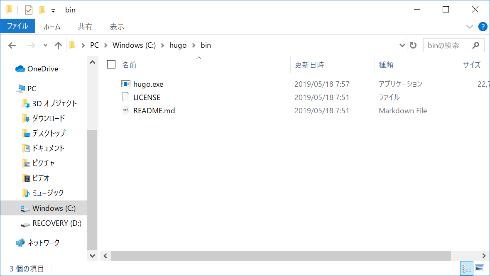
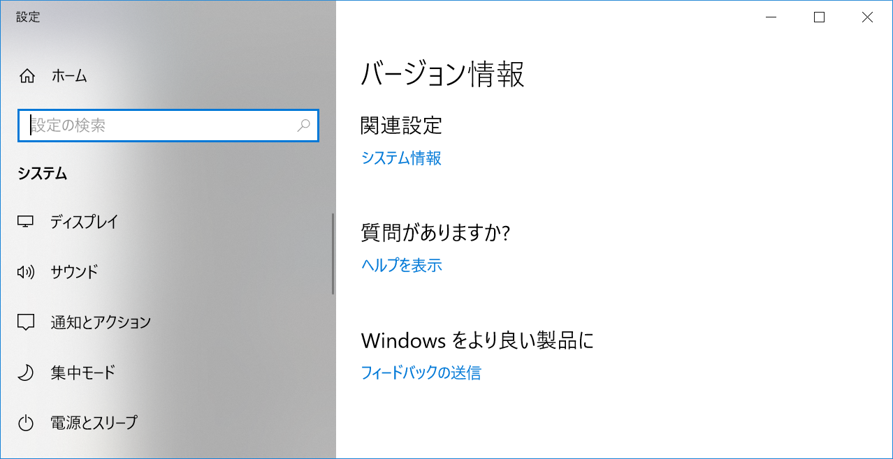
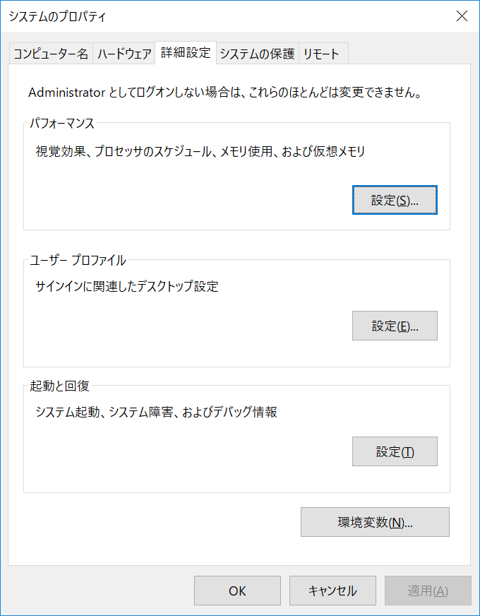

この記事の環境は64bit Windows10 Homeです。

## HUGOのインストール

1. [https://github.com/gohugoio/hugo/releases](https://github.com/gohugoio/hugo/releases)から環境にあった最新版をダウンロードしてくる

2. 適当な場所にフォルダを作る(C:\hugoなど)

3. 下位にbinフォルダを作る

4. 先ほどダウンロードしてきたファイルを解凍し、中身をbinフォルダに入れる

5. `C:\Hugo\bin` にパスを通す
    - スタートボタンを右クリック＞システム
    - 関連設定＞システム情報
    
    - 左側のシステム詳細設定＞右下の環境変数
    
    - 下側のシステム環境変数から"Path"を探し、ダブルクリック
    - 右側の新規をクリック、`C:\Hugo\bin` を入力し、OK

6. 
